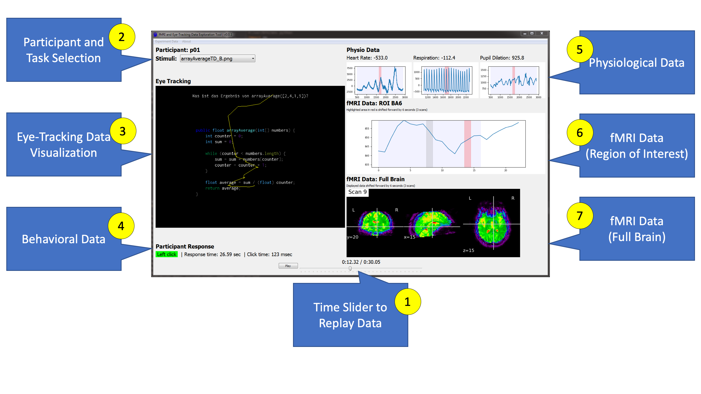

# CodersMUSE



See more details in our [submitted ICPC tool track paper](docs/ICPCToolPaperUnderReview.pdf). Alternatively, watch our short [demo video [2m:03s]](https://youtu.be/Qc_FWHTVM0w).

[](https://travis-ci.com/brains-on-code/CodersMUSE)

## Abstract
Program comprehension is a central cognitive process in programming and has been in the focus of researchers for decades, but is still not thoroughly unraveled. Multi-modal measurement methods are a way to gain a more holistic understanding of program comprehension. However, there is no proper tool support that lets researchers explore synchronized, conjoint multi-modal data, specifically designed for the needs in software engineering. In this paper, we present CodersMUSE, a prototype implementation that aims to satisfy this crucial need.

## Features

In essence, CodersMUSE provides a synchronized, integrated presentation of different modalities. The focus is particularly on multi-modal experiments in software engineering.

Currently supported modalities are:
* behavioral data (response time, click time, correctness)
* eye tracking
* psycho-physiological data (heart rate, respiration)
* fMRI data (via nipy)

For more information, see the paper or watch the video below. Keep in mind that this is an early prototype and not a mature tool.

## Demo Video

[](https://youtu.be/Qc_FWHTVM0w)

### Sample Data

If you want to try out CodersMUSE, clone the repository. Besides the python scripts, it comes with some sample data located in `/sample`. Currently, the full-brain fMRI data cannot be shared on this public repository due to German privacy regulations. Please contact us if you would like to access a sample fMRI data set.

### Using Your Own Data

If you want to explore your own experiment data, make sure to preprocess and prepare your data in a way that is compatible to CodersMUSE's expectation. This first prototype is rather inflexible when it comes to input data.

The data should be in `.csv` files. One file each for behavioral, eye-tracking, and psycho-physiological data. The `.csv` files should be:

* Comma-separated
* Be aligned to one common `Time` column
* Time resolution is in hundreds of a second
* Use the same column naming as the sample files (see `/sample/data`)
* Already be preprocessed, if necessary (e.g., smoothing)

If you encounter problems, please let us know.

## License
```
MIT License

Copyright (c) 2019 Norman Peitek

Permission is hereby granted, free of charge, to any person obtaining a copy
of this software and associated documentation files (the "Software"), to deal
in the Software without restriction, including without limitation the rights
to use, copy, modify, merge, publish, distribute, sublicense, and/or sell
copies of the Software, and to permit persons to whom the Software is
furnished to do so, subject to the following conditions:

The above copyright notice and this permission notice shall be included in all
copies or substantial portions of the Software.

THE SOFTWARE IS PROVIDED "AS IS", WITHOUT WARRANTY OF ANY KIND, EXPRESS OR
IMPLIED, INCLUDING BUT NOT LIMITED TO THE WARRANTIES OF MERCHANTABILITY,
FITNESS FOR A PARTICULAR PURPOSE AND NONINFRINGEMENT. IN NO EVENT SHALL THE
AUTHORS OR COPYRIGHT HOLDERS BE LIABLE FOR ANY CLAIM, DAMAGES OR OTHER
LIABILITY, WHETHER IN AN ACTION OF CONTRACT, TORT OR OTHERWISE, ARISING FROM,
OUT OF OR IN CONNECTION WITH THE SOFTWARE OR THE USE OR OTHER DEALINGS IN THE
SOFTWARE.
```
